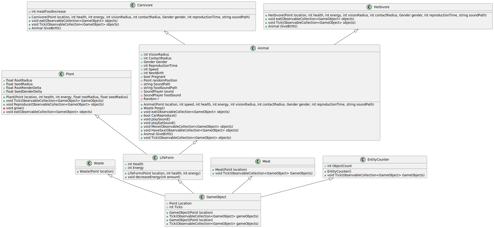
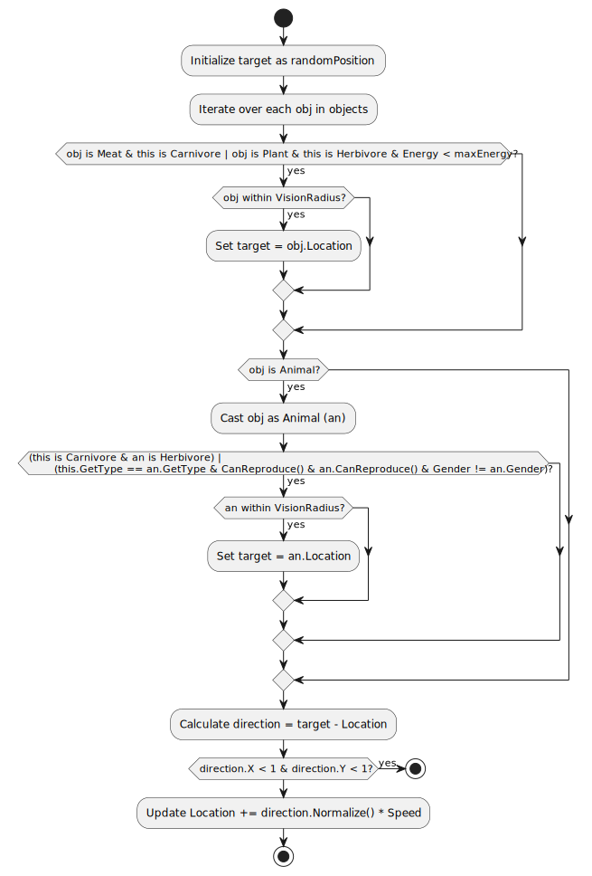

# Rapport de projet

Diagrammes de classes pour les ViewModels ajoutés

Diagramme d'activités pour la recherche de "destination" d'un animal et la gestion du déplacement de cet animal

## Utilisation des principes Solid
* Open-closed principle : Notre code est constitué de classes pouvant être étendues (Exemple: étendre la classe Carnivore si on veut ajouter une espèce)
